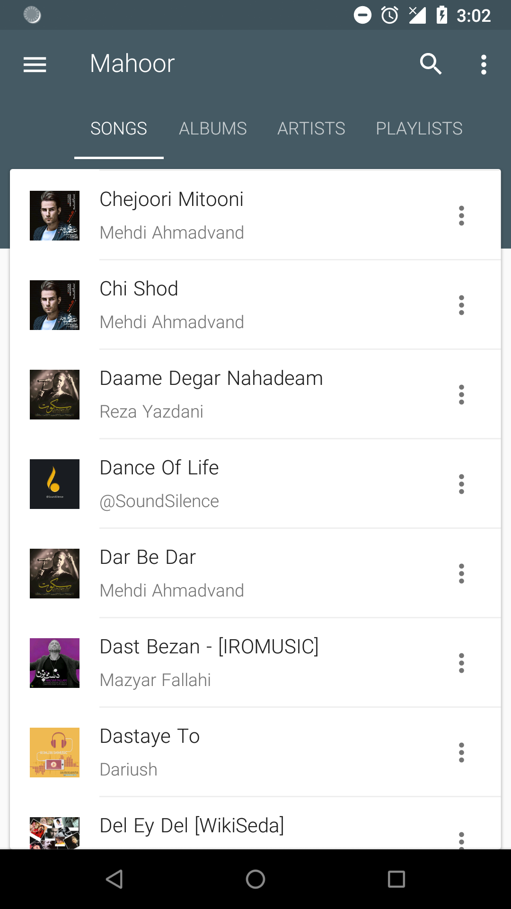
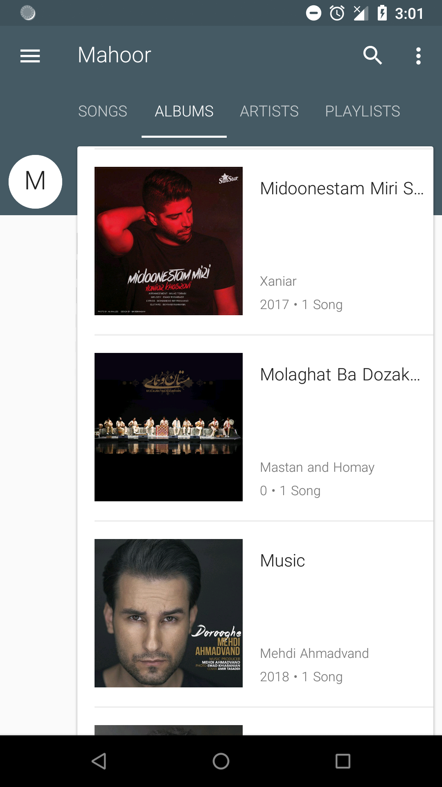
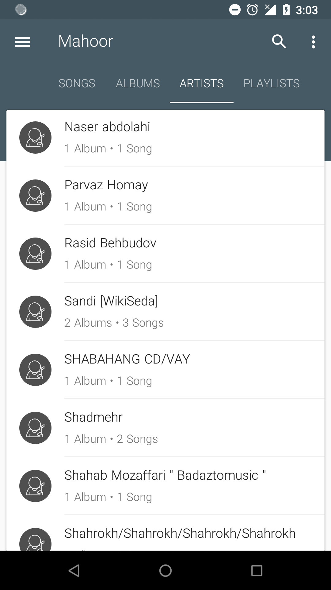
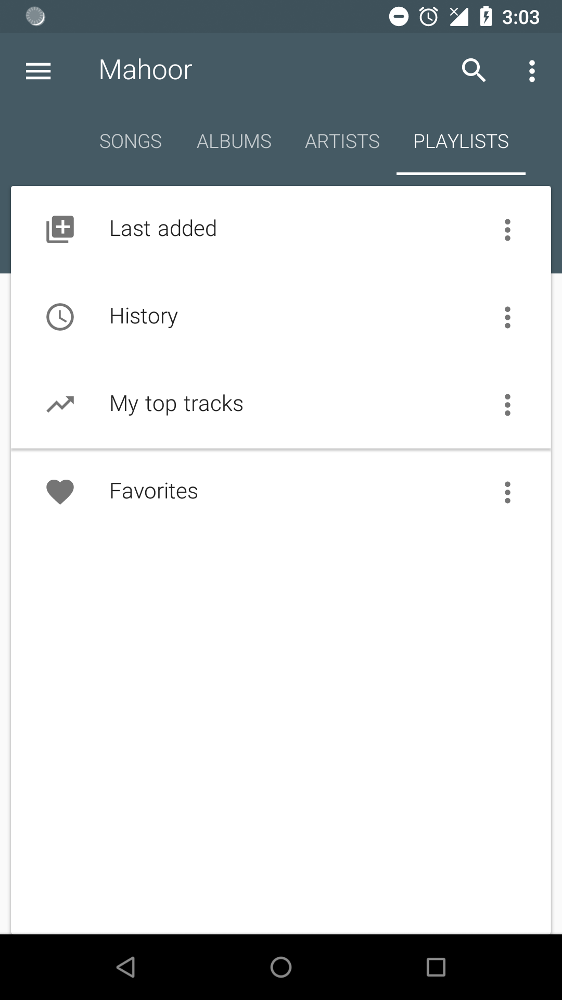
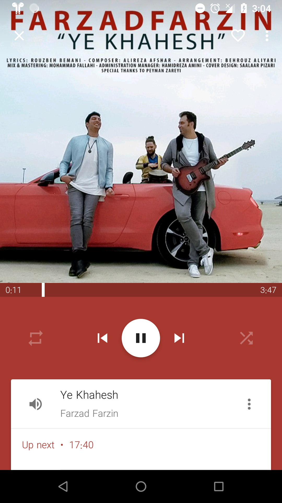
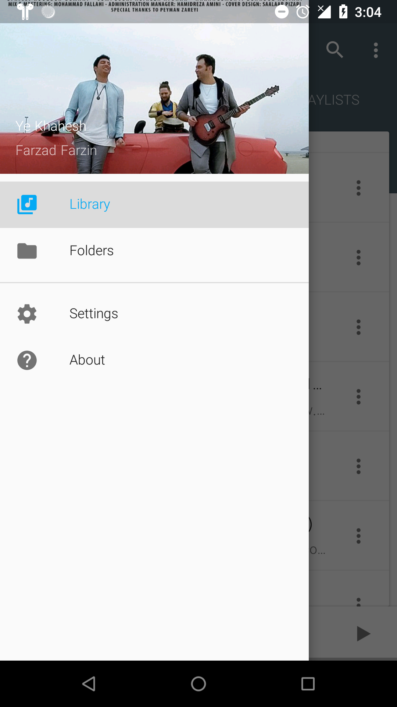

# Mahoor
Mahoor is a music player based on Karim Abou Zeid\'s open source Phonograph music player.

#### Myket download

See app in myket [Link](https://myket.ir/app/rezaei.mohammad.mahoor)

# License
GNU General Public License v3.0

Permissions of this strong copyleft license are conditioned on making available complete source code of licensed works and modifications, which include larger works using a licensed work, under the same license. Copyright and license notices must be preserved. Contributors provide an express grant of patent rights.
